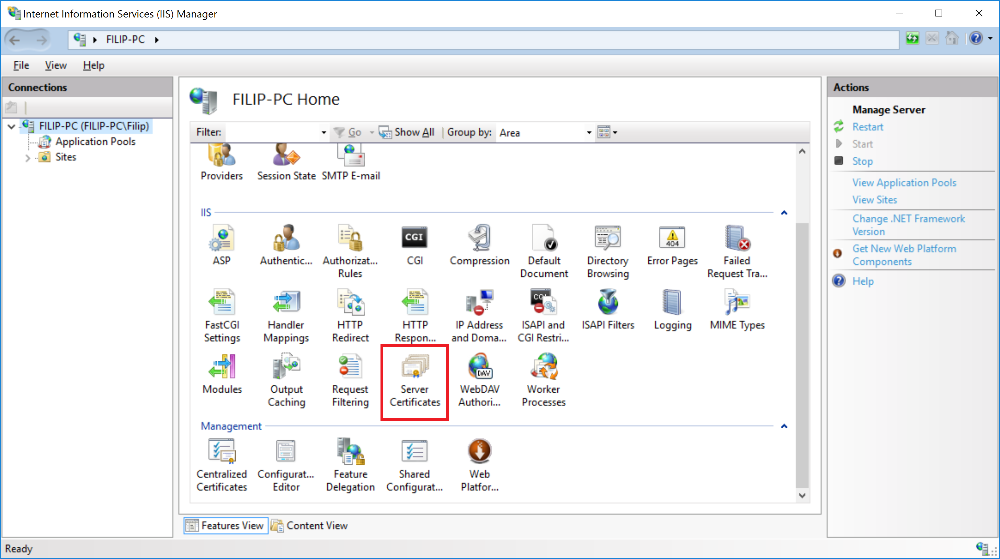
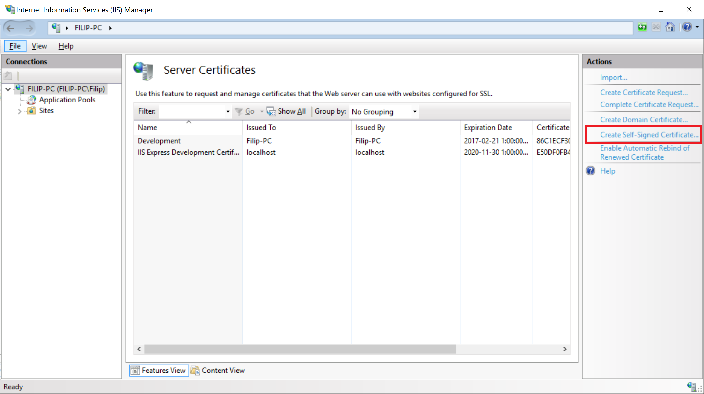
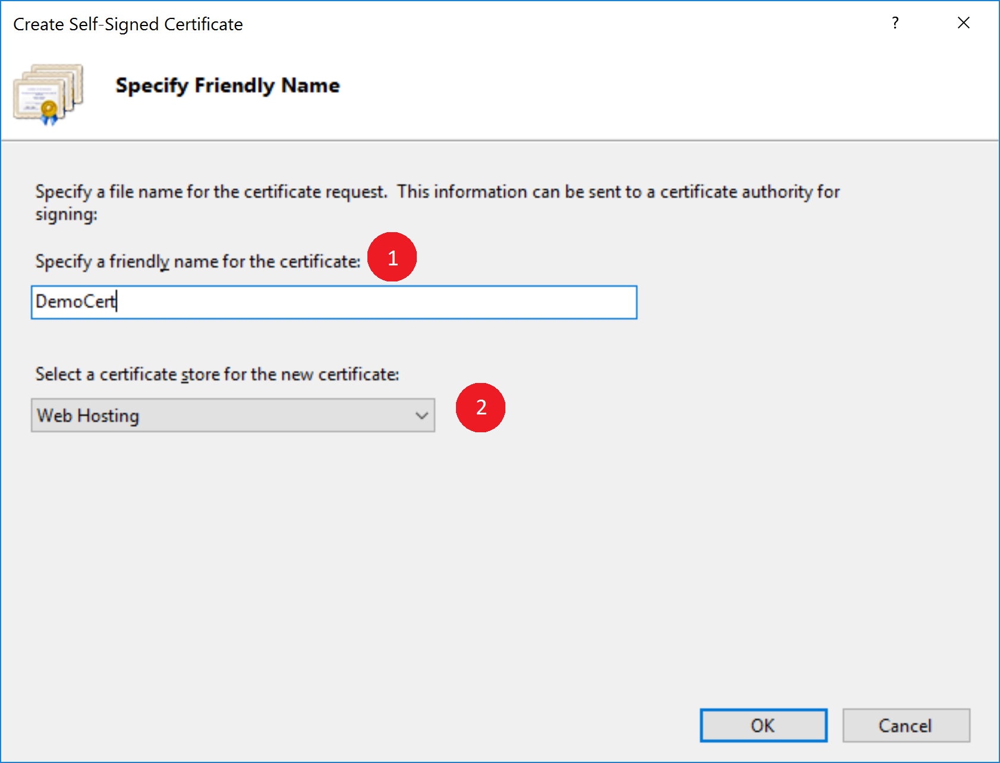
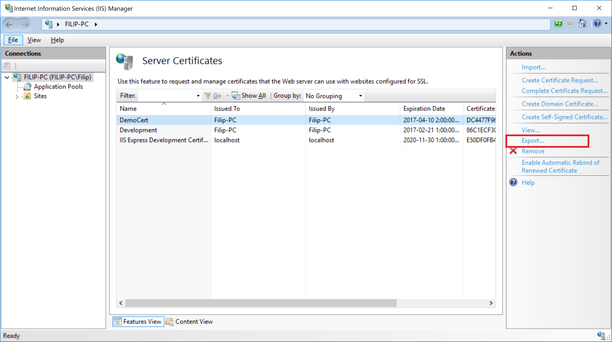
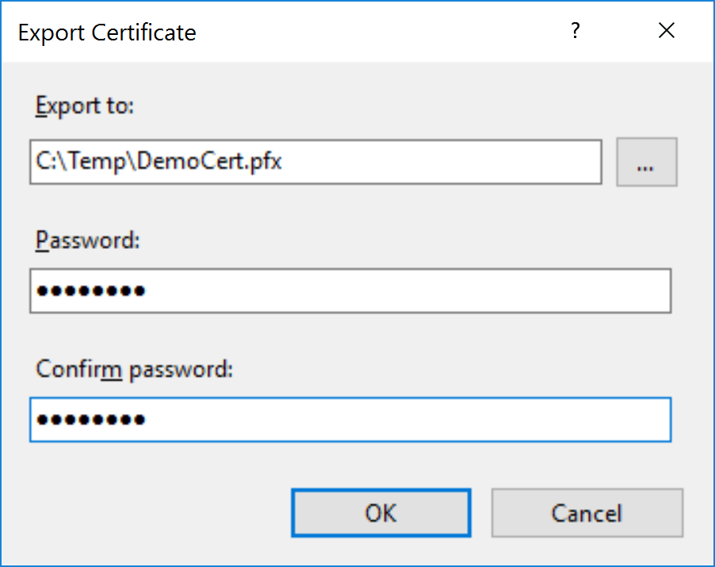

# Creating a Self Signed Certificate

## Prepare and Generate the certificate using the IIS Manager

Go to the Server Certificates view


Select to Create a Self-Signed Certificate


Specify a name and set the certificate store to Web Hosting


Select to Export the certificate


Give it a file location and a password, same password you would use in for instance IdentityServer


## Get the Certificate as a Base64 encoded string

```
var certificate = Convert.ToBase64String(File.ReadAllBytes(@"C:\Temp\DemoCert.pfx"));
```